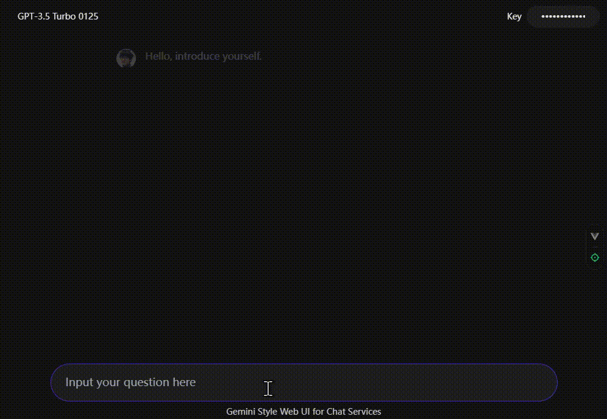

# Gemini Chat UI

## DEMO

[Online Demo](https://gemini-chat-ui-six.vercel.app/)

  

## Features

- [x] Support for ChatGPT API.
- [x] Implemented a text fade-in effect similar to Gemini.
- [x] Implemented a chat UI similar to Gemini.

## Usage

- Select the model in the upper left corner.
- Enter the API Key in the upper right corner.

## TODO
- [ ] Implementing access to the Gemini API.
- [ ] Implementing the function of modifying chat messages.
- [ ] Implementing fine-tuning of generated content.
- [ ] Implementing the function of uploading images.
- [ ] Implementing the parameter adjustment function.
- [ ] Implementing the API call cost display.
